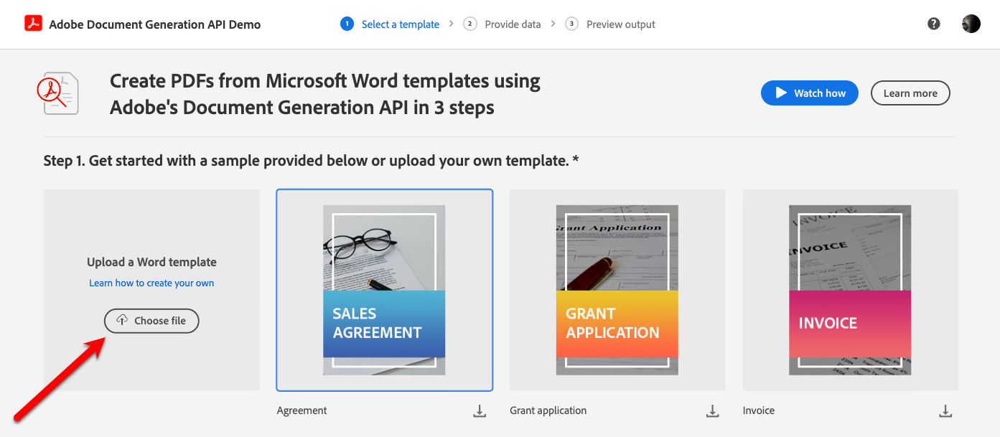

# document-generation-cookbook

[Adobe Document Genertation API](https://developer.adobe.com/document-services/docs/overview/document-generation-api/) merges JSON data with Microsoft Word based templates to create dynamic documents.

This repo contains a set of " recipes" for some common tags that my customers have struggled trying to figure out on their own, plus a few more. Each folder has a different type of  recipe containing all the ingredients you need:
- A Word file containing different tags
- A JSON file containing the data to merge
- A PDF file showing what the output should when the abvove are run through Document Generation API. 

You can try out the template/data pairs for free using the [Adobe Document Generation API Demo](https://acrobatservices.adobe.com/dc-docgen-playground/index.html#/) on Adobe's web site. Just select "Choose file" in the first box on the page then follow the prompts to upload the .docx and .json files.

## What is an Adobe Document Genertation API Template
A document template is basically a ready-made file that’s set up with special tags to pull in dynamic content. When you run the Document Generation process, these tags grab values from your input data and swap them out with the real info to create a new PDF.

The template tags are the markers that show where the dynamic content should go in your document. The tags can reference the JSON values directly or use [JSONata](https://docs.jsonata.org/overview.html) expressions to manipulate the data before merging. See the [documentation](https://developer.adobe.com/document-services/docs/overview/document-generation-api/templatetags/) to read more about template tags.

Document Generation API itself is very easy to use but to produce the desired layout, you need to know a lot about Microsoft Word, JSON, and JSONata. Use the [JSONata Exerciser](https://try.jsonata.org/) to get the JSONata expressions correct before adding them to your tag. You can paste your own JSON in the left panel and then use the upper right panel to test your expression and see the result in real time below it. 

I'll be adding new  recipes as time permits. Feel free to make requests and I'll do my best to add a  recipe to meet your needs.